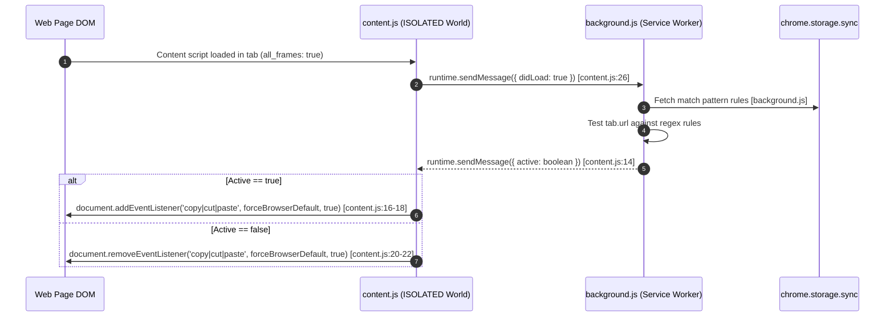

# Tier 1 Competitor Teardown: Don't F*** With Paste (DFWP)

## 1. Overview & Project Metadata

| Attribute | Details |
|---|---|
| **Extension Name** | Don't F*** With Paste (DFWP) |
| **Repository** | `jswanner/DontFuckWithPaste` [C1](file:///d:/jPit/jpit-research/04-evidence/citation-log.md#L6) |
| **Version Analyzed** | 3.1 (Manifest V3) |
| **License** | MIT License [C4](file:///d:/jPit/jpit-research/04-evidence/citation-log.md#L9) |
| **Target Browsers** | Chrome, Firefox, Edge, Brave |
| **Primary Architecture** | Background Service Worker (`background.js`) + ISOLATED World Content Script (`content.js`) |
| **Source Location** | `01-competitor-source/DontFuckWithPaste` |

---

## 2. Technical Architecture & Injection Mechanism

DFWP migrated to Manifest V3 in version 3.0+. Its architecture relies on a standard messaging bridge between the background service worker and content scripts injected into web pages.



### Manifest Configuration (`manifest.json`)
- Declares `"manifest_version": 3` [manifest.json:23](file:///d:/jPit/jpit-research/01-competitor-source/DontFuckWithPaste/manifest.json#L23).
- Uses `"all_frames": true` to capture iframes [manifest.json:12](file:///d:/jPit/jpit-research/01-competitor-source/DontFuckWithPaste/manifest.json#L12).
- Permissions requested: `"storage"`, `"tabs"` [manifest.json:28-31](file:///d:/jPit/jpit-research/01-competitor-source/DontFuckWithPaste/manifest.json#L28-L31). Note: `<all_urls>` match pattern is specified in `content_scripts` [manifest.json:14](file:///d:/jPit/jpit-research/01-competitor-source/DontFuckWithPaste/manifest.json#L14).

---

## 3. Event Interception Mechanics

The core paste unblocking engine in DFWP is defined in `content.js`:

```javascript
// content.js:9-12
const forceBrowserDefault = function(e){
  e.stopImmediatePropagation();
  return true;
};
```

### Mechanism Analysis
1. **Capturing Phase Listener**: DFWP registers listeners with `useCapture = true` (3rd argument to `addEventListener`):
   ```javascript
   // content.js:16-18
   document.addEventListener('copy', forceBrowserDefault, true);
   document.addEventListener('cut', forceBrowserDefault, true);
   document.addEventListener('paste', forceBrowserDefault, true);
   ```
2. **Event Propagation Stopping**: When a `copy`, `cut`, or `paste` event fires on any element in the document tree, DFWP's capturing listener fires **before** bubbling listeners on child elements.
3. `e.stopImmediatePropagation()` prevents any subsequent listeners attached to the target element (or intermediate parents) from executing.
4. Returning `true` (or not calling `e.preventDefault()`) allows the browser's default browser action (writing/reading clipboard data to/from the DOM input element) to execute.

---

## 4. Rule Engine & Storage System (`dfwp.js`)

DFWP provides custom inclusion/exclusion rules using domain matching.

### Rule Model (`dfwp.js`)
- `Rule` class [dfwp.js:17-29](file:///d:/jPit/jpit-research/01-competitor-source/DontFuckWithPaste/dfwp.js#L17-L29): Wraps a string value into a JavaScript `RegExp`. If empty, defaults to `(?=a)b` (never matches).
- `Rules` set [dfwp.js:31-58](file:///d:/jPit/jpit-research/01-competitor-source/DontFuckWithPaste/dfwp.js#L31-L58): Extends standard `Set` to handle serialization/deserialization into arrays stored in `chrome.storage.sync` (or fallback `chrome.storage.local`) [dfwp.js:9-13](file:///d:/jPit/jpit-research/01-competitor-source/DontFuckWithPaste/dfwp.js#L9-L13).

---

## 5. Technical Strengths & Advantages

1. **Clean Minimalist Footprint**: Very small JS codebase (~300 LOC total across all files).
2. **Capturing Phase Interception**: Intercepts bubbling event listeners on target elements before site script execution in standard DOM scenarios.
3. **Multi-Frame Support**: Declares `all_frames: true` in `manifest.json`, ensuring embedded iframes (e.g., payment forms) receive listener attachment.

---

## 6. Vulnerabilities, Edge Cases & Failure Modes

Despite its simplicity, DFWP fails across numerous modern web application architectures and anti-copy mechanisms:

### A. Synthetic & Controlled React Input Failure
- Modern web applications built on React / Vue / Angular maintain internal synthetic state. React 17+ attaches event listeners at the root container (`#root`), but React's synthetic event dispatcher registers event handlers early.
- When `e.stopImmediatePropagation()` is called in the ISOLATED world, while it prevents page DOM listeners attached later, it **also blocks site synthetic events that update internal component state**.
- Result: Pasting inserts text into the DOM node, but React state remains empty, resulting in form submission errors or immediate state overwrite.

### B. Shadow DOM Isolation
- DFWP calls `document.addEventListener(...)`. Events dispatched inside closed Shadow Roots or shadow trees with `delegatesFocus` or custom shadow event handling bypass document-level event propagation depending on boundary traversal and event re-targeting.

### C. `beforeinput` & Modern Clipboard API Bypass
- DFWP *only* intercepts `copy`, `cut`, and `paste` events.
- Modern paste blockers use `beforeinput` (e.g., `inputType === 'insertFromPaste'`) and call `e.preventDefault()`. DFWP does NOT register a listener for `beforeinput`, leaving this vector completely unblocked.

### D. Inline Attribute Cancellation (`onpaste="return false"`)
- Direct property overrides (e.g. `<input onpaste="return false;">` or `element.onpaste = () => false`) execute as element property handlers. DFWP's document capturing listener handles events, but inline handlers evaluated during dispatch phase can still block or clear clipboard data.

### E. Right-Click Context Menu & Selection Blocking
- DFWP does not handle `contextmenu`, `selectstart`, `dragstart`, or `mousedown` events. Sites that disable right-click context menus or text selection (`user-select: none` via CSS or JS) are unaffected by DFWP.

### F. ISOLATED World Execution Window (Race Conditions)
- DFWP injects content scripts via standard manifest entry. If a site attaches `paste` event handlers early in inline `<script>` tags before DFWP initializes or responds to its `background.js` state check, site script listeners may execute or hijack events before DFWP turns `active`.

---

## 7. Analysis of Reported GitHub Issues (C2)

Analysis of the 50 GitHub issues logged in `jswanner/DontFuckWithPaste` reveals recurring breakdown categories:

1. **State Out-of-Sync Across Tabs**: `background.js` failed to re-evaluate or notify open tabs when options/rules changed until page reload.
2. **Broken Form Submissions on Password Managers**: Pasting into fields like password inputs on banking sites (e.g. Capital One, Chase) allowed characters visually, but broke JS state validators, causing "Invalid Format" submit errors.
3. **Wysiwyg / Rich Text Editors (Quill, TinyMCE, Draft.js)**: Wysiwyg editors rely on custom `paste` handling to format HTML HTML content. DFWP's aggressive `stopImmediatePropagation()` completely broke rich-text copy/paste formatting on Google Docs, Notion, and Jira.

---

## 8. Summary Rating for DFWP

| Metric | Score (1-5) | Comment |
|---|---|---|
| **Efficacy on Simple HTML Forms** | 4.5 / 5 | Excellent for basic standard `<input>` and `<textarea>` elements. |
| **Efficacy on Modern Web Apps (React/Vue)** | 1.5 / 5 | Frequently breaks framework state or fails on synthetic events. |
| **Coverage of Anti-Copy Vectors** | 2.0 / 5 | Only targets `copy`, `cut`, `paste`. Ignored `beforeinput`, CSS, contextmenu, Canvas. |
| **Code Architecture & MV3 Readiness** | 3.5 / 5 | Clean MV3 conversion, but vulnerable to SW lifecycle delays. |
