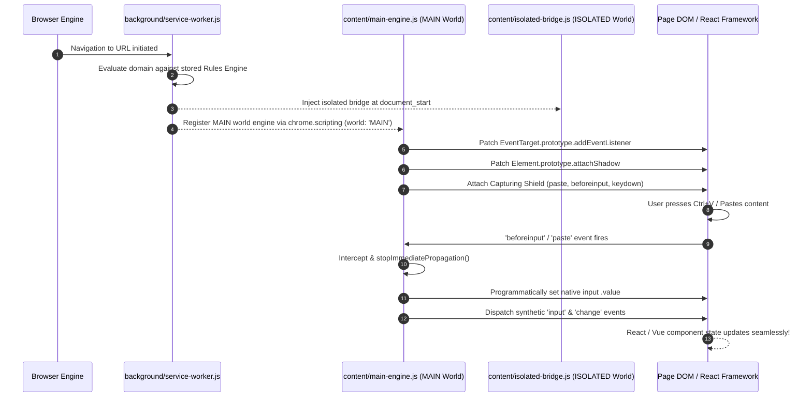

# Product & Technical Feature Specification: Just Paste it — "jPit" v1.0

## 1. Executive Product Vision

| Attribute | Specification Details |
|---|---|
| **Product Name** | Just Paste it — **jPit** |
| **Version** | v1.0.0 |
| **Author** | Thanmai |
| **Target Extension Standard** | Manifest V3 (MV3) |
| **Supported Browsers** | Google Chrome, Mozilla Firefox, Microsoft Edge, Brave Browser |
| **Primary Mission** | To permanently eliminate arbitrary copy/paste, right-click, and text selection restrictions across all web applications without breaking framework state or UI interactions. |

---

## 2. System Architecture & File Structure

jPit v1.0 is engineered around a modular **Dual Execution Engine** architecture that runs complementary logic across Chrome's `ISOLATED` and `MAIN` execution worlds.

```
jpit-extension/
├── manifest.json                 # Cross-browser MV3 manifest definition
├── background/
│   └── service-worker.js         # Service worker handling storage & rule matching
├── content/
│   ├── isolated-bridge.js        # ISOLATED world script handling messaging & UI badges
│   └── main-engine.js            # MAIN world unblocking engine (prototype hooks & event shields)
├── popup/
│   ├── popup.html                # Modern glassmorphism toolbar popup
│   ├── popup.js                  # Quick toggle logic & stats display
│   └── popup.css                 # Dark theme custom CSS
├── options/
│   ├── options.html              # Advanced rule manager & engine settings
│   ├── options.js                # Rule storage CRUD & JSON import/export
│   └── options.css               # Full-page options layout styling
├── lib/
│   ├── browser-polyfill.js       # Universal browser.* / chrome.* API wrapper
│   └── rule-evaluator.js         # Fast domain matching engine
└── icons/
    ├── icon-16.png
    ├── icon-32.png
    ├── icon-48.png
    └── icon-128.png
```

---

## 3. High-Level Execution Sequence



---

## 4. Unblocking Engine Core Modules

jPit v1.0 consists of 5 dedicated unblocking modules operating in unison:

### Module 1: Capturing Event Shield
- **Target Events**: `paste`, `copy`, `cut`, `beforeinput`, `contextmenu`, `selectstart`, `dragstart`.
- **Logic**: Attaches `addEventListener` with `useCapture = true`.
- **`beforeinput` Specialization**: Detects `e.inputType === 'insertFromPaste'` or `'insertFromDrop'` and suppresses `e.preventDefault()`.

### Module 2: Framework State Synthesizer (React / Vue / Angular Guard)
- When a paste event is intercepted on an input-like target (`HTMLInputElement`, `HTMLTextAreaElement`, `contenteditable`), jPit executes synthetic state synchronization:
  ```javascript
  function updateFrameworkInput(element, text) {
    const proto = element.tagName === 'TEXTAREA' 
      ? window.HTMLTextAreaElement.prototype 
      : window.HTMLInputElement.prototype;
    const valueSetter = Object.getOwnPropertyDescriptor(proto, 'value').set;
    
    // Calculate new cursor insertion point
    const start = element.selectionStart || 0;
    const end = element.selectionEnd || 0;
    const currentVal = element.value || '';
    const newVal = currentVal.substring(0, start) + text + currentVal.substring(end);
    
    valueSetter.call(element, newVal);
    element.selectionStart = element.selectionEnd = start + text.length;
    
    // Dispatch bubbling synthetic events
    element.dispatchEvent(new Event('input', { bubbles: true, composed: true }));
    element.dispatchEvent(new Event('change', { bubbles: true, composed: true }));
  }
  ```

### Module 3: System Hotkey Shield
- Protects `Ctrl+V` / `Cmd+V`, `Ctrl+C` / `Cmd+C`, `Ctrl+X` / `Cmd+X`, and `Ctrl+A` / `Cmd+A` from site `keydown` handler theft.
- **Shift Key Bypass**: If the user holds `Shift` while right-clicking (`Shift + Right Click`), jPit temporarily bypasses custom context menus to allow native browser menus.

### Module 4: Prototype & Shadow DOM Guard
- Executed in `MAIN` world at `document_start`.
- Hooks `EventTarget.prototype.addEventListener` to suppress site code trying to attach blocking paste listeners.
- Hooks `Element.prototype.attachShadow` to automatically extend unblocking shields into web components and closed Shadow Roots.

### Module 5: Selective CSS Selection Engine
- Injects scope-limited CSS unblocking rather than destructive global wildcard overrides:
  ```css
  /* Injected selectively into active document when text selection is enabled */
  input, textarea, [contenteditable="true"], .jpit-unblock-selection {
    -webkit-user-select: text !important;
    user-select: text !important;
  }
  ```

---

## 5. Site Rules Engine & Storage Specification

jPit provides 3 flexible operational modes:

### Operating Modes
1. **Smart Auto Mode (Default)**: Automatically unblocks copy and paste on all websites *without* overriding right-click context menus or text selection CSS (prevents site UI breakage).
2. **Aggressive Mode**: Unblocks paste, copy, cut, right-click context menus, text selection locks, and drag-and-drop globally.
3. **Custom Site Rules**: Allows domain-by-domain configuration.

### Storage Data Schema (`chrome.storage.sync`)
```json
{
  "settings": {
    "globalMode": "smart_auto",
    "hotkeyShield": true,
    "frameworkSynthesizer": true,
    "stripTrackingParams": false,
    "cleanZeroWidthChars": true
  },
  "domainRules": [
    {
      "id": "rule_01",
      "pattern": "*.bank.com",
      "matchType": "wildcard",
      "unblockPaste": true,
      "unblockCopy": true,
      "unblockContextMenu": false,
      "unblockSelection": false
    },
    {
      "id": "rule_02",
      "pattern": "^https://.*\\.medium\\.com/.*$",
      "matchType": "regex",
      "unblockPaste": true,
      "unblockCopy": true,
      "unblockContextMenu": true,
      "unblockSelection": true
    }
  ],
  "stats": {
    "totalPastesUnblocked": 142,
    "totalCopiesUnblocked": 89
  }
}
```

---

## 6. UI / UX Design Specifications

### Action Popup (`popup.html`)
- **Dimensions**: 320px width x 420px height.
- **Theme**: Premium Dark Glassmorphism UI (Deep Indigo `#0F172A`, Vivid Teal `#14B8A6` accents, Inter font).
- **Key Elements**:
  - Site Domain Header (e.g. `github.com`).
  - Master Unblock Toggle (Large animated switch).
  - Quick Toggle Pills: `[ Paste ]`, `[ Copy ]`, `[ Right-Click ]`, `[ Text Select ]`.
  - Unblocked Action Counter (Live animation).
  - "Open Advanced Options" link button.

### Options Page (`options.html`)
- **Layout**: Clean sidebar navigation (General Settings, Domain Rules, Anti-Bypass Engines, Import/Export).
- **Rule Table**: CRUD interface with live rule testing input.
- **Import/Export**: One-click JSON backup & restore.

---

## 7. Cross-Browser MV3 Manifest Specification

```json
{
  "manifest_version": 3,
  "name": "jPit — Just Paste it",
  "version": "1.0.0",
  "description": "Bypass arbitrary paste, copy, right-click, and text selection restrictions seamlessly across all web apps.",
  "permissions": [
    "storage",
    "activeTab",
    "scripting"
  ],
  "host_permissions": [
    "<all_urls>"
  ],
  "background": {
    "service_worker": "background/service-worker.js"
  },
  "action": {
    "default_popup": "popup/popup.html",
    "default_icon": {
      "16": "icons/icon-16.png",
      "32": "icons/icon-32.png",
      "48": "icons/icon-48.png",
      "128": "icons/icon-128.png"
    }
  },
  "options_ui": {
    "page": "options/options.html",
    "open_in_tab": true
  },
  "icons": {
    "16": "icons/icon-16.png",
    "32": "icons/icon-32.png",
    "48": "icons/icon-48.png",
    "128": "icons/icon-128.png"
  }
}
```

---

## 8. Privacy, Security & Compliance Guarantees

1. **100% Offline & Private**: Zero external analytics, zero network requests, zero telemetry.
2. **Minimal Permissions**: Does not request background clipboard reading unless user explicitly triggers canvas force paste.
3. **Open Source**: Released under the OSI-approved MIT License.
