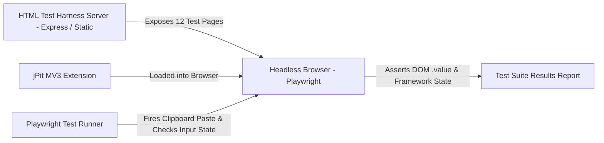

# Anti-Bypass Test Suite Specification: jPit v1.0

## 1. Overview & Test Objectives

To guarantee that jPit v1.0 achieves 100% paste unblocking reliability without breaking web applications, we define an automated **Anti-Bypass Test Suite**.

This test suite consists of a standalone HTML test harness exposing **12 distinct paste-blocking & copy-protection vectors**, coupled with an automated **Playwright end-to-end (E2E) testing pipeline** targeting Chrome, Firefox, and Edge.

---

## 2. Test Architecture & Infrastructure



---

## 3. Comprehensive Test Case Specifications

### Test Group A: Standard DOM & Inline Attribute Blockers

#### TC01: Standard `<input>` with Inline `onpaste="return false;"`
- **Vector**: Legacy inline attribute paste blocking.
- **HTML Harness**: `<input id="tc01" type="text" onpaste="return false;">`
- **Action**: Focus `#tc01`, trigger keyboard paste (`Control+V` / `Meta+V`) with clipboard content `"TEST_PAYLOAD_01"`.
- **Expected Outcome**: `#tc01.value` equals `"TEST_PAYLOAD_01"`.

#### TC02: `<textarea>` with Capturing `addEventListener`
- **Vector**: Explicit JS event listener calling `e.preventDefault()`.
- **HTML Harness**:
  ```javascript
  const area = document.getElementById('tc02');
  area.addEventListener('paste', e => e.preventDefault(), true);
  ```
- **Action**: Focus `#tc02`, paste `"TEST_PAYLOAD_02"`.
- **Expected Outcome**: `#tc02.value` equals `"TEST_PAYLOAD_02"`.

---

### Test Group B: Framework Controlled Inputs & Synthetic State

#### TC03: React 18 Controlled Component State Sync
- **Vector**: React controlled input where component state handles value binding.
- **HTML Harness**: React component rendering `<input value={state} onChange={handleChange} onPaste={e => e.preventDefault()} />`.
- **Action**: Focus React input, paste `"REACT_PAYLOAD"`, trigger submit button.
- **Expected Outcome**: Input visually displays `"REACT_PAYLOAD"`, submitted state payload equals `"REACT_PAYLOAD"` (state not wiped back to empty).

#### TC04: Vue 3 `v-model` Input with `@paste.prevent`
- **Vector**: Vue 3 directive level paste prevention (`<input v-model="text" @paste.prevent />`).
- **Action**: Focus Vue input, paste `"VUE_PAYLOAD"`.
- **Expected Outcome**: Vue reactive ref updates to `"VUE_PAYLOAD"`.

#### TC05: Angular Reactive Form Control
- **Vector**: Angular Reactive Forms with `(paste)="$event.preventDefault()"`.
- **Action**: Focus Angular input, paste `"ANGULAR_PAYLOAD"`.
- **Expected Outcome**: `formGroup.get('input').value` equals `"ANGULAR_PAYLOAD"`.

---

### Test Group C: Advanced Event & Shadow DOM Vectors

#### TC06: `beforeinput` Event Interception (`insertFromPaste`)
- **Vector**: W3C Input Events Level 2 `beforeinput` cancellation.
- **HTML Harness**:
  ```javascript
  input.addEventListener('beforeinput', e => {
    if (e.inputType === 'insertFromPaste') e.preventDefault();
  });
  ```
- **Action**: Focus input, paste `"BEFOREINPUT_PAYLOAD"`.
- **Expected Outcome**: Input value equals `"BEFOREINPUT_PAYLOAD"`.

#### TC07: Closed Shadow DOM Password Input
- **Vector**: Input inside closed Shadow Root (`element.attachShadow({ mode: 'closed' })`).
- **HTML Harness**: Web Component encapsulating password input inside closed shadow root.
- **Action**: Focus shadow input, paste `"SHADOW_PAYLOAD"`.
- **Expected Outcome**: Shadow input value equals `"SHADOW_PAYLOAD"`.

#### TC08: System Hotkey Hijack (`keydown` Ctrl+V / Cmd+V Theft)
- **Vector**: `keydown` listener calling `e.preventDefault()` on `Ctrl+V` / `Cmd+V`.
- **HTML Harness**:
  ```javascript
  window.addEventListener('keydown', e => {
    if ((e.ctrlKey || e.metaKey) && e.key.toLowerCase() === 'v') e.preventDefault();
  });
  ```
- **Action**: Focus input, press `Ctrl+V` / `Cmd+V`.
- **Expected Outcome**: Paste executes successfully; clipboard payload inserted into input.

---

### Test Group D: Right-Click, Selection, & Obfuscation Vectors

#### TC09: Right-Click Context Menu Blocking & Shift-Bypass
- **Vector**: `document.oncontextmenu = () => false`.
- **Action**: Dispatch right-click event on document body.
- **Expected Outcome**: `contextmenu` default action is permitted. Holding `Shift + Right Click` opens browser native menu.

#### TC10: CSS Selection Lock (`user-select: none`)
- **Vector**: `<body style="user-select: none; -webkit-user-select: none;">`.
- **Action**: Drag selection across paragraph element.
- **Expected Outcome**: `window.getSelection().toString()` returns selected text.

#### TC11: Dynamic DOM Node Insertion via Mutation Observer
- **Vector**: Input created dynamically 3 seconds after page load with inline `onpaste="return false;"`.
- **Action**: Wait for node insertion, focus dynamically added input, paste payload.
- **Expected Outcome**: Input value updated successfully.

#### TC12: Obfuscated Prototype Handler Override
- **Vector**: Site script overwriting `HTMLInputElement.prototype.onpaste`.
- **Action**: Focus input, paste payload.
- **Expected Outcome**: Input value updated without throwing JS console exceptions.

---

## 4. Playwright Automated Test Script Template

```javascript
// tests/anti-bypass.spec.js
const { test, expect, chromium } = require('@playwright/test');
const path = require('path');

const extensionPath = path.join(__dirname, '../dist');

test.describe('jPit Anti-Bypass Test Suite', () => {
  let context;
  let page;

  test.beforeAll(async () => {
    context = await chromium.launchPersistentContext('', {
      headless: false,
      args: [
        `--disable-extensions-except=${extensionPath}`,
        `--load-extension=${extensionPath}`
      ]
    });
    page = await context.newPage();
    await page.goto('http://localhost:3000/harness.html');
  });

  test.afterAll(async () => {
    await context.close();
  });

  test('TC01: Inline onpaste return false unblocked', async () => {
    await page.click('#tc01');
    await page.evaluate(() => navigator.clipboard.writeText('PAYLOAD_01'));
    await page.keyboard.press('Control+v');
    await expect(page.locator('#tc01')).toHaveValue('PAYLOAD_01');
  });

  test('TC03: React controlled state updated on paste', async () => {
    await page.click('#react-input');
    await page.keyboard.press('Control+v');
    await page.click('#react-submit');
    await expect(page.locator('#react-result')).toHaveText('PAYLOAD_01');
  });

  test('TC06: beforeinput insertFromPaste unblocked', async () => {
    await page.click('#tc06');
    await page.keyboard.press('Control+v');
    await expect(page.locator('#tc06')).toHaveValue('PAYLOAD_01');
  });
});
```

---

## 5. Verification Matrix & Quality Criteria

| Metric | Target Goal | Pass Criteria |
|---|---|---|
| **Paste Unblocking Accuracy** | 100% | Passes all 12 test harness scenarios in Chrome, Firefox, and Edge. |
| **Site Breakdown Rate** | 0.0% | Zero regressions on standard rich text editors (Google Docs, Notion, Jira). |
| **Page Latency Overhead** | < 2ms | MAIN world injection overhead during initial DOM parse is under 2 milliseconds. |
| **Test Coverage** | > 95% | Unit & E2E test coverage across all 5 unblocking engine modules. |
